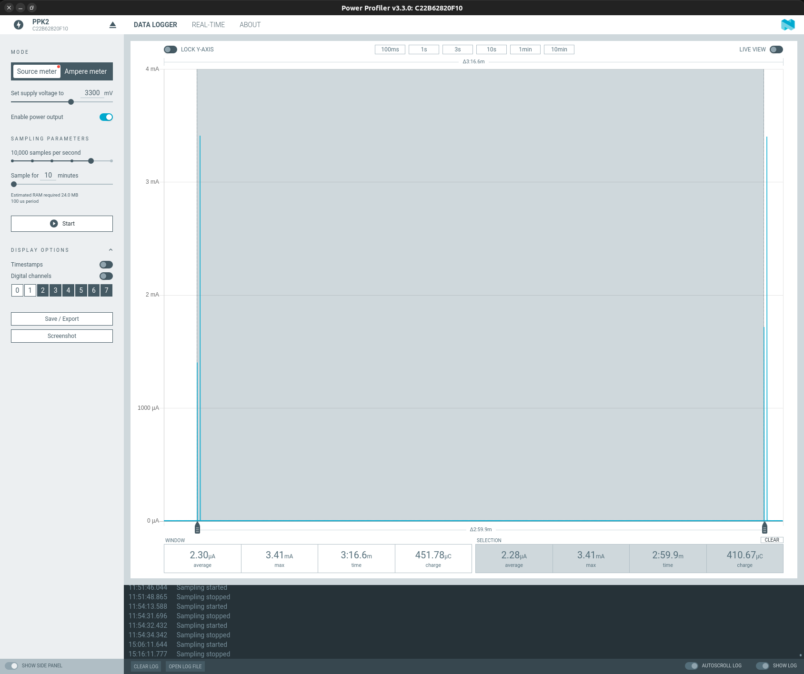
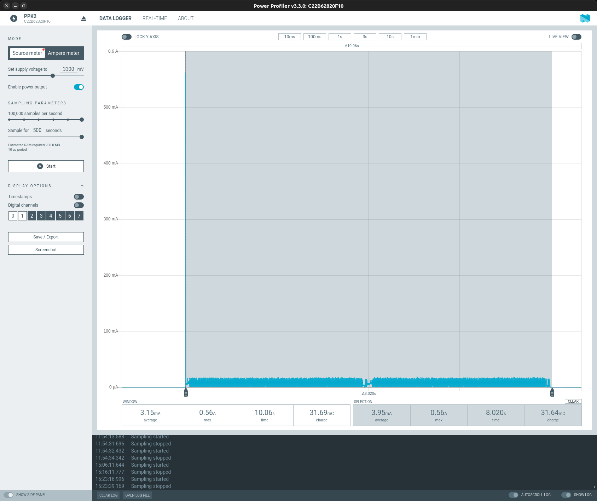

# Table of Contents

- [Overview](#overview)
- [Project Management](#project-management)
- [Battery Life](#battery-life)

# Overview


## Internal


# Project Management

## Init

```bash
mkdir project-nrf-dishwasher-sign
cd project-nrf-dishwasher-sign
docker run --rm -u $(id -u):$(id -g) -v $(pwd):/new -w /new zephyrprojectrtos/ci:v0.26.6 \
        bash -c "west init -m https://github.com/fgervais/project-nrf-dishwasher-sign.git . && west update"
```

## Build

```bash
cd application
docker compose run --rm nrf west build -b pink_panda -s app
```

## menuconfig

```bash
cd application
docker compose run --rm nrf west build -b pink_panda -s app -t menuconfig
```

## Clean

```bash
cd application
rm -rf build/
```

## Update

```bash
cd application
docker compose run --rm nrf west update
```

## Flash

### nrfjprog
```bash
cd application
docker compose -f docker-compose.yml -f docker-compose.device.yml \
        run nrf west flash
```

### pyocd
```bash
cd application
pyocd flash -e sector -t nrf52840 -f 4000000 build/zephyr/zephyr.hex
```

# Battery Life

## Power consumption

- Vcc = 3.3v
- Internal DC/DC converter

### Idle

Average: 2.28µA

The code wakes up every 3 minutes to feed the watchdog.



### Screen refresh

31.64mC



## Expected life (Energizer L91 AA Ultimate Lithium)

3500 mAh = 12600 Coulomb

As the usage consumption is so low compared to the battery capacity, the
limiting factor is basically the self discharge of the cell.

The self discharge on those primary cells is quite low so the batteries are
expected to last a long time.

### Idle all the time

Idle means the CPU idle current plus 1 screen refresh every 12 hours.

Idle consumption per day:
```math
2.28 \times 10^-6 \, \frac{C}{s} \times (60 \times 60 \times 24) = 197 \times 10^-3 \frac{C}{day}
```

Automatic refresh consumption per day:
```math
31.64 \times 10^-3 \, C \times 2 = 63.28 \times 10^-3 \, C
```

Total per day:
```math
197 \times 10^-3 \frac{C}{day} + 63.28 \times 10^-3 \, \frac{C}{day} = 260.28 \times 10^-3 \, \frac{C}{day}
```

Runtime:
```math
12600 \, C \div 260.28 \times 10^-3 \, \frac{C}{day} = 48410 \, days = 132 \, years
```

### Refreshing all the time

```math
\frac{12600 \, C}{31.64 \times 10^-3 \, C} = 398 \times 10^3 \, refreshes
```
